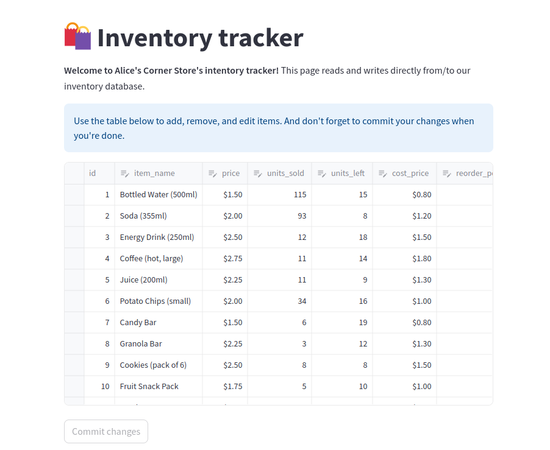

# Streamlit API Example

A basic streamlit webpage example using SQLite3 as a local Database and Pandas to show data.

## Requirements

To use the example API you will need to install:
- streamlit
- pandas
- sqlite3

You can install the libraries by using the following commands:

~~~
pip install streamlit
~~~
~~~  
pip install pandas
~~~
~~~
pip install sqlite3
~~~

## Run Example

To run the example, open a terminal inside the **streamlit_ejemplo_api** folder and then copy the following command:

~~~
streamlit run streamlit_ejemplo.py
~~~
*(You can skip the email part by pressing enter)*  
Note: A webpage in your web browser will be opened. If not, you can use the localhost URL provided in the terminal 

